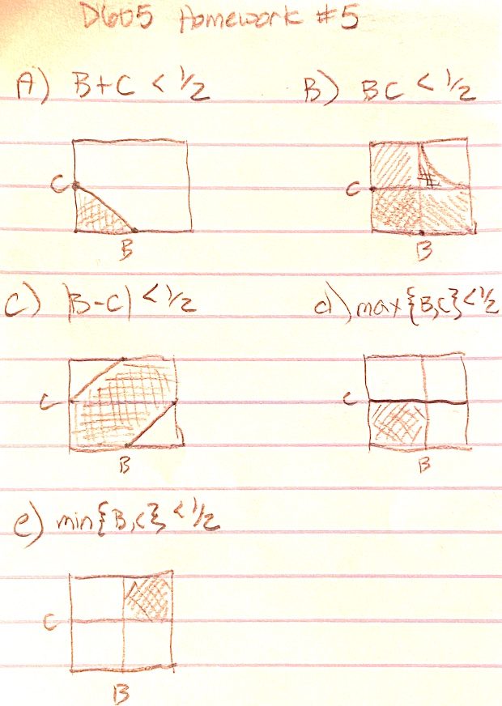

```{r setup, include=TRUE}
knitr::opts_chunk$set(echo = TRUE)
library(tinytex)
library(Matrix)
library(pracma)
```

Source files: [https://github.com/djlofland/DATA605_S2020/tree/master/]

## Problem Set 1

Choose independently two numbers B and C at random from the interval [0, 1] with
uniform density. Prove that B and C are proper probability distributions.
Note that the point (B,C) is then chosen at random in the unit square.

```{r}
(B <- runif(1))
(C <- runif(1))

# Genrate a large sample size and show that we se a uniform density
D <- runif(10000)
hist(D)
```

Find the probability that:

a) B + C < 1/2

On a unit square, this is the area of the triangle bounded by (0,0), (0, 0.5), (0.5, 0).  Conceptually, both B and C must be < 0.5.  Since we are adding them, then if B=0.5, then C=0 and oppositely if C=0.5 then B=0.   
```{r}
(punif(.5) * punif(0.5)) * 0.5 
```

b) BC < 1/2

If either B < 0.5 or C < 0.5, then BC < 0.5 but we also have a small curve where B > 0.5 and C > 0.5 that still works (e.g. 0.6 * 0.6 = 0.36)

P(B < 0.5) + P(C < 0.5) - P(B < 0.5 and C < 0.5) + $\int^1_{0.5} \int^1_{0.5} x*y\ dx\ dy$

```{r}
fun <- function(x, y) x*y
aoc <- integral2(fun, 1, 0.5, 1, 0.5,)

(punif(0.5) + punif(0.5)) - (punif(0.5) * punif(0.5)) + aoc$Q
```

c) |B - C| < 1/2

On the Unit square, when B > 0.5, we exclude values of C < 0.5 (bottom right corner) and also exclude cases where B < 0.5 and C > 0.5 (upper left corner).

1 - [P(b > 0.5) * P(C < 0.5) + P(B < 0.5) * P(C > 0.5)]

```{r}
(1 - (punif(0.5)*punif(0.5)*.5 + punif(0.5)*punif(0.5)*.5))
```

d) max{B, C} < 1/2

Both B and C are < 0.5.  

P(B < 0.5) * P(C < 0.5)

```{r}
punif(0.5)*punif(0.5)
```

e) min{B, C} < 1/2

Both B and C are > 0.5

P(B > 0.5) * P(C > 0.5)

```{r}
punif(0.5)*punif(0.5)
```


