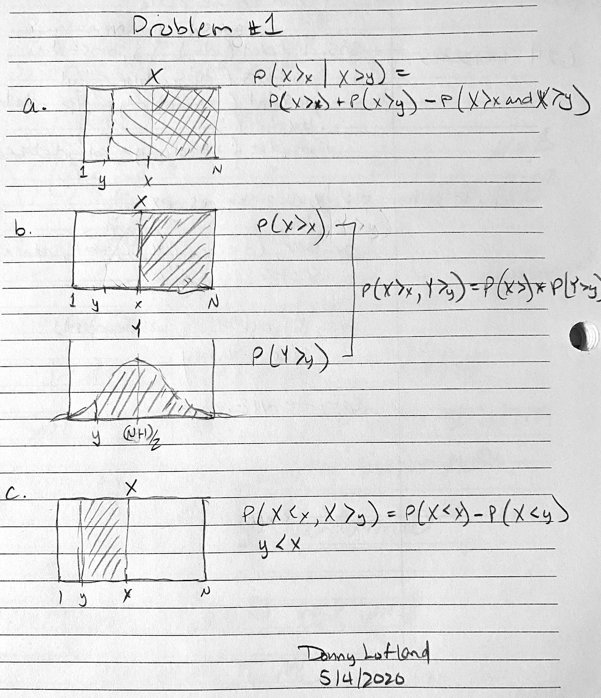

```{r setup, include=TRUE}
knitr::opts_chunk$set(echo = TRUE)
library(tinytex)
library(tidyverse)
library(Hmisc)
library(corrplot)
library(MASS)
library(PerformanceAnalytics)
```

Source files: [https://github.com/djlofland/DATA605_S2020/tree/master/]

## Problem 1: Prob Distributions

Using R, generate a random variable X that has 10,000 random *uniform* numbers from 1 to N, where N can be any number of your choosing greater than or equal to 6.  Then generate a random variable Y that has 10,000 random *normal* numbers with a mean of $\mu = \sigma = (N+1)/2$  

```{r Problem_1}
N <- 8
count <- 10000

Y_mu <- (N+1)/2
Y_std <- Y_mu

# Generate distributions
X <- runif(count, 1, N)
Y <- rnorm(count, Y_mu, Y_std)

x <- median(X)
y <- quantile(Y, 0.25)

hist(X)
hist(Y)
```

### Part A: Probability

*5 points. Probability.*   Calculate as a minimum the below probabilities a through c.  Assume the small letter "x" is estimated as the median of the X variable, and the small letter "y" is estimated as the 1st quartile of the Y variable.  Interpret the meaning of all probabilities.




**a.   P(X>x | X>y)**		

```{r Problem_1A_a}
prob_X_gt_x <- sum((X > x) == TRUE) / count       # 1 - punif(x, 1, N)  ... expected: 0.5
prob_X_gt_y <- sum((X > y) == TRUE) / count   
prob_X_gt_x_and_y <- sum((X > x) == TRUE & (X > y) == TRUE) / count 
(answer <- prob_X_gt_x + prob_X_gt_y - prob_X_gt_x_and_y)
```

> Note that P(X>x) overlaps P(X>y), so to calculate the P(X>x or X>y), we need to determine the independent probabilities and subtract the overlap where X>x and X>y. In this situation, the probabilities are NOT independent. 
> **ANSWER: `r  answer`**

**b.  P(X>x, Y>y)**

```{r Problem_1A_b}
prob_X_gt_x <- 1 - punif(x, 1, N) # 0.5

y_z <- (y - Y_mu) / Y_std
prob_Y_gt_y <- 1 - pnorm(y_z, Y_mu, Y_std)

(answer <- prob_X_gt_x * prob_Y_gt_y)
```

> Since P(X>x) is independent of P(Y>y), we just multiply the probability of each.
> **ANSWER: `r  answer`**

**c.  P(X<x | X>y)**

```{r Problem_1A_c}
prob_X_lt_x <- punif(x, 1, N)
prob_X_lt_y <- punif(y, 1, N)

(answer <- prob_X_lt_x - prob_X_lt_y)
```

> Since y < x, we are finding the probability that X falls within the region bounded by y and x.  This is simply the probability of X < x minus probability X < y.    
> **ANSWER: `r  answer`**

### Part B: Probabilities

*5 points.*   Investigate whether $P(X>x\text{ and }Y>y)=P(X>x)\ P(Y>y)$ by building a table and evaluating the marginal and joint probabilities.

```{r Problem_1B}
# MARGINAL Probabilities


# JOINT Probability Table
prob_X_gt_x <- sum((X>x) == TRUE) / count
prob_X_le_x <- 1 - prob_X_gt_x
prob_Y_gt_y <- sum((Y>y) == TRUE) / count
prob_Y_le_y <- 1 - prob_Y_gt_y

prob_table <- matrix(c(prob_Y_le_y*prob_X_le_x, prob_Y_le_y*prob_X_gt_x, 
                       prob_Y_gt_y*prob_X_le_x, prob_Y_gt_y*prob_X_gt_x), ncol=2)
(total <- sum(prob_table))

(p_joint <- prob_table[2,2])
(p_marg <- prob_X_gt_x * prob_Y_gt_y)
```

#### Joint & Marginal Table

|          | $Y\le y$ | $Y>y$  |       |
| -------- | -------- | ------ | ----- |
| $X\le x$ | `r prob_Y_le_y*prob_X_le_x`   | `r prob_Y_gt_y*prob_X_le_x` | **`r prob_X_le_x`**   |
| $X>x$    | `r prob_Y_le_y*prob_X_gt_x`   | `r prob_Y_gt_y*prob_X_gt_x` | **`r prob_X_gt_x`**   |
|          | **`r prob_Y_le_y`**    | **`r prob_Y_gt_y`**  | **`r total`**   |


> **ANSWER: p_joint (`r p_joint`) is equal to p_marg (`r p_marg`)**

### Part C: Independence

*5 points.*  Check to see if independence holds by using **Fisher’s Exact Test** and the **Chi Square Test**.  What is the difference between the two? Which is most appropriate?

```{r Problem_1C}
a <- sum((X<=x) == TRUE & (Y<=y) == TRUE)
b <- sum((X>x) == TRUE & (Y<=y) == TRUE)
c <- sum((X<=x) == TRUE & (Y>y) == TRUE)
d <- sum((X>x) == TRUE & (Y>y) == TRUE)

cont_table <- matrix(c(a, b, c, d), 
                     ncol = 2,
                     dimnames = list(X = c("<= x", "> x"), 
                                     Y = c("<= y", "> y")))
(cont_table)
fisher.test(cont_table)
chisq.test(cont_table)
```

> Our null hypothesis is that *X IS independent of Y* and the alternative is that they are dependent.  With both the Fisher and Chi Squared Tests, we observerd a **p-value of 0.3437, which is greater that 0.05**, so we do **NOT reject** the null hypothesis and accept that **X IS independent of Y**.  This was expected since by design, X and Y were drawn from different distributions.  Fisher's Test is intended when cell sizes are small and Chi Squared when cell sizes are large.  Fisher's is more accurate at small values and requires more computation at larger values, whereas, Chi Squared is a good approximation at larger values.  With large values, Fisher and Chi Squared should give the same result (as we see).  In this situation, the cell sizes are large, so the Chi Squared Test would have been more appropriate.  

## Problem 2: Kaggle

You are to register for Kaggle.com (free) and compete in the House Prices: Advanced Regression Techniques competition.  https://www.kaggle.com/c/house-prices-advanced-regression-techniques .  I want you to do the following.

> **Note: My Kaggle username is djlofland**

### Part A: Desc/Inferential Stats

*5 points.  Descriptive and Inferential Statistics.* Provide univariate descriptive statistics and appropriate plots for the training data set.  Provide a scatterplot matrix for at least two of the independent variables and the dependent variable. Derive a correlation matrix for any three quantitative variables in the dataset.  Test the hypotheses that the correlations between each pairwise set of variables is 0 and provide an 80% confidence interval.  Discuss the meaning of your analysis.  Would you be worried about familywise error? Why or why not?

#### Load Kaggle Data

```{r Problem_2A_Load}
train <- as_tibble(read.csv(file='./datasets/train.csv'))
test <- as_tibble(read.csv(file='./datasets/test.csv'))
```

#### Descriptive Stats

```{r}
# A Few Quantitative Features
plot(train$GrLivArea, train$SalePrice, las=3, main='Sale Price vs Living Area (Above Ground)', xlab='Living Area (Above Ground)', ylab='SalePrice (USD)')
plot(train$TotRmsAbvGrd, train$SalePrice, las=3, main='Sale Price vs Total Rooms (Above Ground)', xlab='Rooms', ylab='SalePrice (USD)')
plot(train$GarageCars, train$SalePrice, las=3, main='Sale Price vs Garage Size', xlab='Garage Size (Cars)', ylab='SalePrice (USD)')

# A Few Categorical Features
plot(train$Neighborhood, train$SalePrice, las=3, main='Sale Price vs Neighborbood', xlab='Neighborbood', ylab='SalePrice (USD)')
plot(train$KitchenQual, train$SalePrice, las=3, main='Sale Price vs Kitchen Quality', xlab='Kitchen Quality', ylab='SalePrice (USD)')
```

#### Feature Correlations

Test the hypotheses that the correlations between each pairwise set of variables is 0 and provide an 80% confidence interval.  

```{r}
library(psych)
library(corrgram)

my_data <- train %>% dplyr::select(X1stFlrSF, FullBath, BedroomAbvGr, GarageCars, HalfBath, WoodDeckSF, LotArea)

my_data %>% 
  corrgram(lower.panel=corrgram::panel.ellipse,
           upper.panel=panel.cor,
           diag.panel=panel.density)

# cols <- train %>% dplyr::select(X1stFlrSF, FullBath, BedroomAbvGr, GarageCars, HalfBath, WoodDeckSF, LotArea)
res <- rcorr(as.matrix(my_data))
corrplot(res$r, type="upper", order="hclust", p.mat = res$P, sig.level = 0.95, insig = "blank")

# Get pairwise Confidence intervals for 80% (ie alpha=0.2)
my_corr <- psych::corr.test(my_data, alpha=.20)
print(my_corr, short=FALSE)
```

> As we see from the plots and tables, most of the pairwise correlations are with -0.2 and +0.3.  For linear regressions, we ideally want features that have no correlation and are thus independent of each other.  The challenge with housing data is that, as we expect, many features are correlated.  Looking at the pairwise correlation table and setting our alpha to 0.2, we find that only LotArea and HalfBath have a confidence interval for r that overlaps 0.0.  The next closest is WoodDeckSF and BedroomAbvGr.  SInce we do see correlations, between features, we will expect any linear model to not be as accurate at predicting SalePrice.  That said, many of these correlations are small, so the effect on predictions may not be dramatic.  Using 80% confidence bounds, we are reasonable confident our correlations are NOT zero for most pairs, however, the magnitude difference from 0 is not that large.  So, if we have type I errors such that the real population falls outside our interval, it probably won't result in a very large r, either positive or negative and consequently, familywise errors won't lead to major differences in prediction power of a linear model.   
 
### Part B: Linear Alg

*5 points. Linear Algebra and Correlation.*  Invert your correlation matrix from above. (This is known as the precision matrix and contains variance inflation factors on the diagonal.) Multiply the correlation matrix by the precision matrix, and then multiply the precision matrix by the correlation matrix. Conduct LU decomposition on the matrix. 

```{r Problem_2B}
library(matlib)

corr_mat <- as.matrix(my_corr$r)

# Make sure determinant != 0, i.e. the inverse exists
print(paste('Determinant of Correlation Matrix: ', det(corr_mat)))

# Invert the Correlation Matrix to get the Precision Matrix
print('Presision Matrix: ')
(pres_mat <- inv(corr_mat))

# Multiply the Correlation Matrix by the Presision Matrix and vice versa
print('Correlation Matrix * Precision Matrix and vice versa')
corr_mat %*% pres_mat
pres_mat %*% corr_mat

# Helper function to factor a matrix (from my Homework Assignment #2)
factor_matrix <- function(A) {
  size <- nrow(A)
  max <- size - 1
  
  # Build our base L matrix
  L <- matrix(0, nrow=size, ncol=size)
  
  for (i in 1:size) {
    L[i,i] = 1L
  }
  
  # Copy A into U - we will be decompsing U as we go and keep our orig A
  U <- matrix(0, nrow=size, ncol=size)
  for (r in 1:size) {
    for (c in 1:size) {
      U[r,c] <- A[r,c]
    }
  }
  
  for (c in 1:max) {
    base_row <- c
    next_row <- c+1
    
    for (r in next_row:size) {
      # print(c(c, r))
      
      L[r, c] = U[r, c] / U[base_row, c]
      U[r,] = U[r,] - U[base_row,] * L[r, c]
    }
  }
  
  U <- round(U, 5)
  L <- round(L, 5)
  
  return(list("A"=A, "U"=U, "L"=L))
}

print('LU Decomposition on Presision Matrix')
(lu_matrix <- factor_matrix(pres_mat))

```

### Part C: Calc Prob/Stats

*5 points.  Calculus-Based Probability & Statistics.*  Many times, it makes sense to fit a closed form distribution to data.  Select a variable in the Kaggle.com training dataset that is skewed to the right, shift it so that the minimum value is absolutely above zero if necessary.  Then load the MASS package and run fitdistr to fit an exponential probability density function.  (See  https://stat.ethz.ch/R-manual/R-devel/library/MASS/html/fitdistr.html ).  Find the optimal value of $\lambda$ for this distribution, and then take 1000 samples from this exponential distribution using this value (e.g., rexp(1000, $\lambda$)).  Plot a histogram and compare it with a histogram of your original variable.   Using the exponential pdf, find the 5th and 95th percentiles using the cumulative distribution function (CDF).   Also generate a 95% confidence interval from the empirical data, assuming normality.  Finally, provide the empirical 5th percentile and 95th percentile of the data.  Discuss.

> Note: Based on initial data exploration, none of our raw numeric feature really follow an exponential distribution.  After a bunch of data exploration (not shown), I finally settled on a new feature PropertyAge, defined as YrSold - YrBuilt, reflecting the age of the property when purchased.  While it's not a perfect exponential fit, it was the closet I could find after hours of digging.  There is a large initial peak reflecting that most properties purchased were new.

```{r Problem_2C_i}
# Create a new feature, PropertyAge
train$PropertyAge <- train$YrSold - train$YearBuilt
my_data <- train$PropertyAge

# Fit an expoential distribution using MASS package
dist <- fitdistr(my_data, "exponential")
lambda <- dist$estimate

# drawn random samples from exponential dist with rate, lambda
samples <- rexp(1000, lambda)

hist(my_data, freq = FALSE, breaks = 100, xlim = c(0, quantile(my_data, 0.99)), col = rgb(0,0,1,0.2), xlab='PropertyAge', ylab='Frequency', main='PropertyAge Histograms')
curve(dexp(x, lambda), from = 0, col = "red", add = TRUE)
hist(samples, freq = FALSE, breaks = 250, xlim = c(0, quantile(my_data, 0.99)), col=rgb(1,0,0,0.1), add=TRUE, alpha=0.5)
legend("topright", c("PropertyAge", "Simulation"), col=c(rgb(0,0,1,0.2), rgb(1,0,0,0.1)), lwd=10)
```

> The optimal $\lambda$ for this fit is: **`r lambda`**

```{r Problem_2C_ii}
# Calculate the 5th and 95th percentiles using the PDF, given lambda
lower_5 <- qexp(0.05, lambda)
upper_95 <- qexp(0.95, lambda)
```

> The 5th percential, represents the lower age, i.e. 5% of simulated homes are less than **`r lower_5`** years old.  The 95th percentile, says that 95% of simulated homes are less than **`r upper_95`** years old, or alternatively, 5% of simulated homes are older than **`r upper_95`** years old.

Also generate a 95% confidence interval from the empirical data, assuming normality.  Finally, provide the empirical 5th percentile and 95th percentile of the data.  

```{r Problem_2C_iii}
mu <- mean(train$PropertyAge)
n  <- length(train$PropertyAge)

lower_5 <- mu - 1.96*mu/sqrt(n)
upper_95 <- mu + 1.96*mu/sqrt(n)

percent_5 <- quantile(train$PropertyAge, c(0.05))
percent_95 <- quantile(train$PropertyAge, c(0.95))
```

> The mean age of real properties was **`r mu`** with a 95% confidence interval of **`r lower_5`** and **`r upper_95`** years old.  At the extremes, 5% are less than **`r percent_5`** years old and 5% are older than **`r percent_95`** years old (95% percentile).

### Part D: Modeling

*10 points.  Modeling.*  Build some type of multiple regression model and submit your model to the competition board.  Provide your complete model summary and results with analysis.  Report your Kaggle.com user name and score.

> Please see my GitHub repo and download/view the KaggleProject.ipynb and/or KaggleProject.html files.  
[https://github.com/djlofland/DATA605_S2020/tree/master/FinalProject/](https://github.com/djlofland/DATA605_S2020/tree/master/FinalProject/)
